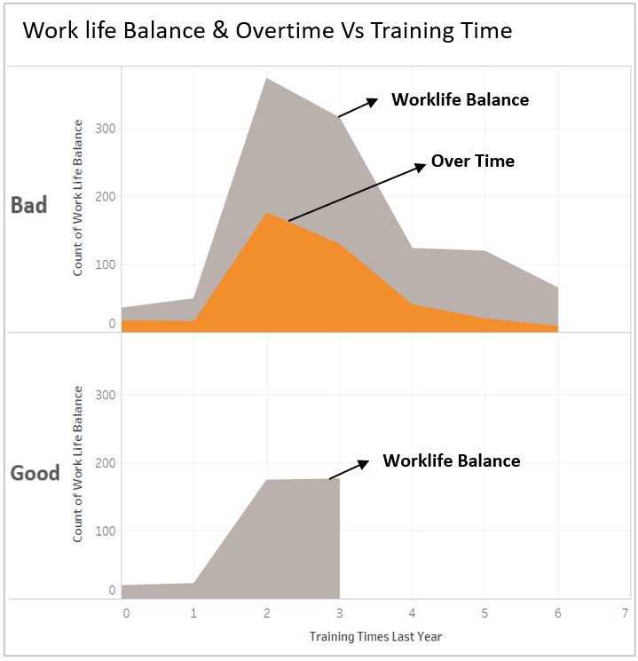
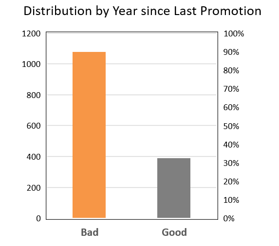
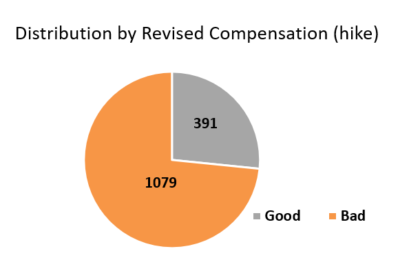
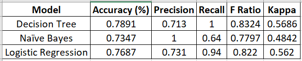

__Introduction__

The selected Dataset consists of employee details who voluntarily resigned in 2016 from the employer: IBM.
This collection of information also gives us a holistic view of employee records, which could have paved path to their attrition with the organization.

It has been the industry’s best practice that every organization is encouraged to permit ‘Good Attrition’ while they should be equally cautious and mindful of the ‘Bad Attrition’ which causes enormous loss in terms of employee experience and ultimately revenue generation.

__Problem Statement__

To identify the factors contributing to uncontrolled ‘Bad Attrition’ in this case and predict the key factors in bringing the overall attrition rate under control.

__Project Objectives__

To come up with a robust predictable model which will help in understanding the most common reasons of attrition for the employees, in order to control the attrition rate.

•	Identify the key contributors of Attrition 

•	Identify Good & Bad attrition rate

•	Apply stages of Data Analytics lifecycle & its processes

•	Observations made & Measures for employer to arrest the uncontrolled attrition

__Data sources and data preparation__

The dataset that we are using in this project has been pulled from Kaggle.
https://www.kaggle.com/pavansubhasht/ibm-hr-analytics-attrition-dataset

__Attributes__

Age			                    - Age of the Employee
Business Travel	            - Employee Travel Frequency
Daily Rate		              - Daily billing rate of the employee by the company
Department		              - Department in which the employee is working within the Company
Distance from Home	        - Distance from employee’s home to company
Education		                - Educational Qualification of the employee
Education Field	            - Employees field of education
Employee Count	            - Employee count in the company
Employee Number	            - Employee number within the company
Environment Satisfaction	  - Environmental satisfaction of the employee in the company
Gender			                - Gender
Hourly Rate		              - Hourly billing rate of the employee by the company
Job Involvement	            - Level of involvement in the job
Job Level		                - Job level of the employee in the company
Job Role		                - Designation of the employee
Job Satisfaction	          - Employee Job satisfaction levels
Marital Status	          	- Marital Status of the employee
Monthly Income	            - Monthly Wage of the employee
Monthly Rate		            - Monthly billing rate of the employee by the company
Number of Companies Worked  – Number of companies in which employee has worked before
Over18			                - Adult
Over Time		                - Number of hours worked by the employee as over time
Percent Salary Hike	        - Percentage of hike in the salary
Performance Rating	        - Performance rating of the employee awarded by the manager
Relationship Satisfaction	  - Relationship Satisfaction levels of the employee
Standard Hours	            - Standard working hours of the employee
Stock Option Level	        - Stock Option Level that the employee is currently holding
Total Working Years	        - Number of years of experience till date
Training Time Last Year	    - Number of training hours received by employee in the previous year
Work Life Balance	          - Work-life balance level
Years at Company	          - Number of years for which employee has associated with the company
Years in Current Role	      - Years of working experience with current designation in the company
Years since last promotion	- Number of years since the last promotion
Years with current Manager	- Number of years that the employee worked under one manager
Attrition			              - Good or Bad attrition


__Data Exploration, visualization, cleansing and transformation__

_Data Exploration_ - Multiple combination of attributes have been tested in order find the best correlated variables. The same can be seen in the below code in Modeling section.

_Cleansing_ - Extensive validation of data revealed no anomalies. Dataset didn't include any nulls or NAN values and hence the scope of cleansing has been reduced for this dataset.

_Transformation_ - Transformed string to numeric values for specific attributes, to suit the modelling.

In order to obtain the correlation between the attributes, we’ve been required to change few numeric variables to alphabetical values.

Attrition = (1 = Yes, 2 = No)
Business Travel = (0 = Non-Travel, 1 = Travel Rarely, 2 = Travel Frequently)
Gender = (1 = Male, 2 = Female)
Marital Status = (1 = Single, 2 = Married, 3 = Divorced)
Overtime = (1 = Yes, 2 = No)
Result = (0 = Bad, 1 = Good)

_Visualization_ - 





__Methodology__

We have tried applying Logistic Regression Model, Naïve Bayes Model and Decision Tree Model for analyzing and predicting.

After observing the Kappa, Accuracy, Sensitivity and Recall values along with the F ratio, we have arrived at the conclusion of utilizing Decision Tree as the best suitable model for our data.

__Modeling and Results__

__1__ Load the Dataset into dataframe 'EmployeeDF'.
```{r}
EmployeeDF = read.csv("HR-Employee-Attrition.csv")
```


__2__ Correlation with Result Attribute
```{r}
cor(EmployeeDF$BusinessTravel, EmployeeDF$Attrition) #0.127
cor(EmployeeDF$DistanceFromHome, EmployeeDF$Attrition)
cor(EmployeeDF$Education, EmployeeDF$Attrition)
cor(EmployeeDF$EnvironmentSatisfaction, EmployeeDF$Attrition)
cor(EmployeeDF$Gender, EmployeeDF$Attrition)
cor(EmployeeDF$HourlyRate, EmployeeDF$Attrition)
cor(EmployeeDF$JobInvolvement, EmployeeDF$Attrition)
cor(EmployeeDF$JobLevel, EmployeeDF$Attrition)
cor(EmployeeDF$JobSatisfaction, EmployeeDF$Attrition)
cor(EmployeeDF$MaritalStatus, EmployeeDF$Attrition)
cor(EmployeeDF$MonthlyIncome, EmployeeDF$Attrition)
cor(EmployeeDF$MonthlyRate, EmployeeDF$Attrition)
cor(EmployeeDF$NumCompaniesWorked, EmployeeDF$Attrition)
cor(EmployeeDF$OverTime, EmployeeDF$Attrition) #0.378
cor(EmployeeDF$PercentSalaryHike, EmployeeDF$Attrition)
cor(EmployeeDF$PerformanceRating, EmployeeDF$Attrition)
cor(EmployeeDF$RelationshipSatisfaction, EmployeeDF$Attrition)
cor(EmployeeDF$StockOptionLevel, EmployeeDF$Attrition) #-0.116
cor(EmployeeDF$TotalWorkingYears, EmployeeDF$Attrition)
cor(EmployeeDF$TrainingTimesLastYear, EmployeeDF$Attrition) #-0.234
cor(EmployeeDF$WorkLifeBalance, EmployeeDF$Attrition)
cor(EmployeeDF$YearsAtCompany, EmployeeDF$Attrition)
cor(EmployeeDF$YearsInCurrentRole, EmployeeDF$Attrition)
cor(EmployeeDF$YearsSinceLastPromotion, EmployeeDF$Attrition) #-0.202
cor(EmployeeDF$YearsWithCurrManager, EmployeeDF$Attrition)
```

__3__ Correlation with Attrition attribute.
```{r}
cor(EmployeeDF$BusinessTravel, EmployeeDF$Attrition) #0.127
cor(EmployeeDF$DistanceFromHome, EmployeeDF$Attrition)
cor(EmployeeDF$Education, EmployeeDF$Attrition)
cor(EmployeeDF$EnvironmentSatisfaction, EmployeeDF$Attrition)
cor(EmployeeDF$Gender, EmployeeDF$Attrition)
cor(EmployeeDF$HourlyRate, EmployeeDF$Attrition)
cor(EmployeeDF$JobInvolvement, EmployeeDF$Attrition)
cor(EmployeeDF$JobLevel, EmployeeDF$Attrition)
cor(EmployeeDF$JobSatisfaction, EmployeeDF$Attrition)
cor(EmployeeDF$MaritalStatus, EmployeeDF$Attrition)
cor(EmployeeDF$MonthlyIncome, EmployeeDF$Attrition)
cor(EmployeeDF$MonthlyRate, EmployeeDF$Attrition)
cor(EmployeeDF$NumCompaniesWorked, EmployeeDF$Attrition)
cor(EmployeeDF$OverTime, EmployeeDF$Attrition) #0.378
cor(EmployeeDF$PercentSalaryHike, EmployeeDF$Attrition)
cor(EmployeeDF$PerformanceRating, EmployeeDF$Attrition)
cor(EmployeeDF$RelationshipSatisfaction, EmployeeDF$Attrition)
cor(EmployeeDF$StockOptionLevel, EmployeeDF$Attrition) #-0.116
cor(EmployeeDF$TotalWorkingYears, EmployeeDF$Attrition)
cor(EmployeeDF$TrainingTimesLastYear, EmployeeDF$Attrition) #-0.234
cor(EmployeeDF$WorkLifeBalance, EmployeeDF$Attrition)
cor(EmployeeDF$YearsAtCompany, EmployeeDF$Attrition)
cor(EmployeeDF$YearsInCurrentRole, EmployeeDF$Attrition)
cor(EmployeeDF$YearsSinceLastPromotion, EmployeeDF$Attrition) #-0.202
cor(EmployeeDF$YearsWithCurrManager, EmployeeDF$Attrition)
```

__4__ Correlation with pairing attributes
```{r}
EmployeeDF$nv1 = (abs(EmployeeDF$YearsSinceLastPromotion) + 0.0000000001) + (abs(EmployeeDF$TrainingTimesLastYear) + 0.0000000001) + (abs(EmployeeDF$OverTime) + 0.0000000001)
#cc$nv1 = (abs(cc$YearsSinceLastPromotion) + 0.0000000001) + (abs(cc$OverTime) + 0.0000000001) + (abs(cc$Education) + 0.0000000001) + (abs(cc$Gender) + 0.0000000001) + (abs(cc$JobLevel) + 0.0000000001) + (abs(cc$JobSatisfaction) + 0.0000000001) + (abs(cc$MaritalStatus) + 0.0000000001)
#cc$nv1 = (abs(cc$YearsSinceLastPromotion) + 0.0000000001) + (abs(cc$PercentSalaryHike) + 0.0000000001)
cor(EmployeeDF$nv1, EmployeeDF$Attrition)
```

__5__ Select 90% of data for training and 10% for testing
```{r}
class(EmployeeDF$Attrition)
class(EmployeeDF)
EmployeeDF[,'Attrition'] = factor(EmployeeDF[,'Attrition'])
class(EmployeeDF$Attrition)

library(e1071)
library(caTools)
split_ind = sample.split(EmployeeDF$Attrition, SplitRatio = 0.9)
train = subset(EmployeeDF, split_ind == TRUE)
test = subset(EmployeeDF, split_ind == FALSE)
nrow(train)
nrow(test)
```

__6__ Naive Bayes Model construction
```{r}
nbDem = naiveBayes(Attrition ~ nv1 + YearsSinceLastPromotion + TrainingTimesLastYear + OverTime, train)
nbDem
```

```{r}
class(EmployeeDF$Attrition)
class(EmployeeDF)
EmployeeDF[,'Attrition'] = factor(EmployeeDF[,'Attrition'])
class(EmployeeDF$Attrition)
```


__7__ Prediction using confusion matrix.
```{r}
library(caret)
library(lattice)
library(ggplot2)
predict_nbDem = predict(nbDem, newdata = test)
class(predict_nbDem)
confusionMatrix(data=predict_nbDem, reference = test$Attrition)
```


__9__ Decision Tree Model construction:
```{r}
library(rpart)
#Model
decisionTreeModel <- rpart(Attrition ~ YearsSinceLastPromotion + TrainingTimesLastYear + OverTime, data=train, method="class")
decisionTreeModel
```


```{r}
library(rpart.plot)
rpart.plot(decisionTreeModel, type=4, extra=1)
```


```{r}

#Predict
pred1 <- predict(decisionTreeModel, test, type="class")
pred1
```

```{r}
#Check model performance
confusionMatrix(test$Attrition, pred1)
```


__10__ Logistic Regression Model construction:
```{r}
nbrelation <- glm(Attrition ~ YearsSinceLastPromotion + TrainingTimesLastYear + OverTime, data=train, family = "binomial")
nbrelation
```


```{r}
relation1_log <- predict(nbrelation, newdata = test,type = "response")
table(test$Attrition, relation1_log>0.3)
```


__Evaluation__

Below are the evaluation metrics obtained from all the three different models that have been attempted on the current dataset. We can observe that the results with decision tree model seems promising.




__Major Challenges__
•	As we are using the sample function to randomly generate the test and train data, evaluation values for the models kept on changing as we make multiple attempts in executing the code.

•	Key parameters such as Last Working Day of the employee was not present in the list, due to which we were unable to understand the exact Attrition reason. While we did overcome this challenge by considering the industry standards as published in the recent HR Journals (Attrition Types such as: Attrition by Billing rate, Overtime, Training, Pay revision, Stock-options & by job Promotion).

•	Also, Primary & Secondary reasons for an employee resignation has not been captured in the dataset, which limits us from further analyzing the situation for every employee who did choose to resign/get separated from the Organization.

_Key Finding_ 
•	Higher correlation amongst the variables resulted in higher accuracy and Kappa values.


__Conclusion and future work__

With the chosen limited dataset, we were able to evaluate the Attrition details to a certain extent using the available variables & employee information. During the Project accomplishments, it is learnt that the attrition rate is beyond the defined industry standard of (15% – 18%) as compared with Service based IT firms.

Due to the uncontrolled Attrition rate as seen in this case, Revenue leakage / loss in terms of investing learning Hours & on-board the successor is anticipated. It is hard to engage Clients of New Business without a consistent average of talents in the firm, relevant experience in a chosen skill.

The Metrics which reveal better observations are listed below:
1. Employee friendly, Employee experience for a stable work environment
2. Last Working Day
3. Employee Index
4. Performance Management

Enhanced model can be built upon adding more attributes and instances to this dataset. Algorithms to achieve greater accurate results can be programed using the present methods advanced. 
